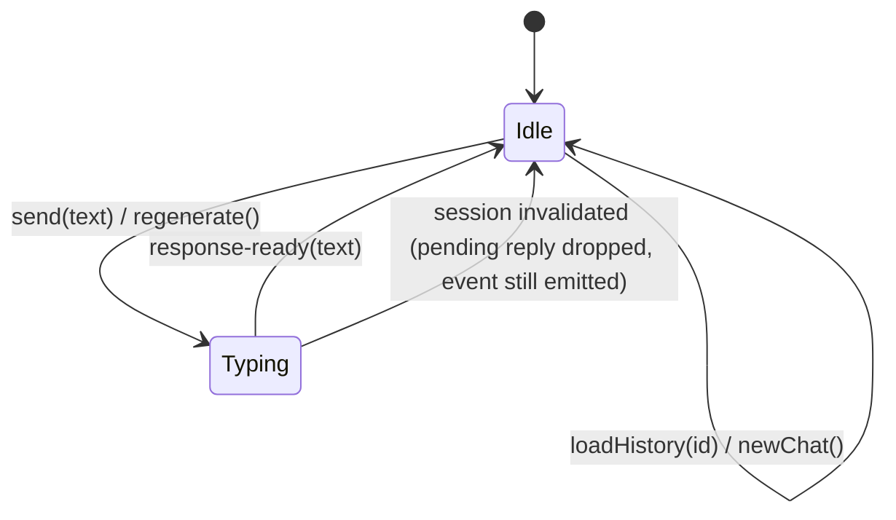
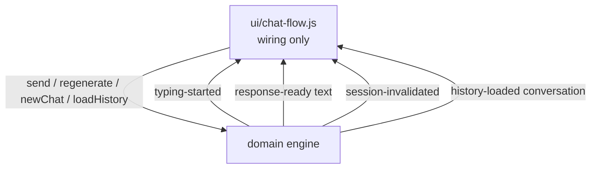

# Conversation Engine Extraction - Plan

## Goal Capsule

- **Objective:** The chat code reads as a clean two-act story — a DOM-free conversation engine that owns behavior, and a UI layer that only renders — so that adding or changing chat behavior requires touching exactly one of them.
- **Means:** Extract orchestration and state from `src/ui/chat-flow.js` and `src/domain/state.js` into a single engine module in `src/domain/`; `ui/` subscribes and renders.
- **Product authority:** This is a technical/architectural change; the "product" is the developer reading and extending the code. No user-visible behavior changes.
- **Open blockers:** None.
- **Execution:** code.

---

## Product Contract

### Summary

Extract a DOM-free conversation engine into `src/domain/` that owns the session-token race guard, response scheduling, responding state, last-user-message memory, and chat switching. The `ui/` layer becomes a thin subscriber that renders presentation effects in reaction to engine events.

### Problem Frame

The repo documents a `ui/ → domain/` layering rule, but the boundary is drawn in the wrong place. `src/domain/state.js` holds UI state (`isResponding`, `welcomeShown`), and `src/ui/chat-flow.js` mixes orchestration with presentation chores — sparkle coordinates, button disabling, input focus, CSS class toggles, and hardcoded `setTimeout` delays. Reading the code story means mentally splitting one file into two concerns on every pass.

### Key Decisions

- **Engine owns timing** (session-settled: user-approved — chosen over UI-owned delays: timing is part of the state machine and must respect session invalidation).
- **Event/callback subscription from engine to UI** (session-settled: user-approved — chosen over direct calls: makes the engine unit-testable without a browser).
- **`welcomeShown` leaves `domain/`** — it is purely rendering state; the engine absorbs the remainder of `src/domain/state.js` entirely. Governs R3, R9.

### Requirements

**Engine (behavior, DOM-free)**

- R1. The engine owns the session-token race guard: switching chat or starting a new chat invalidates all pending scheduled responses, exactly as the current token check does.
- R2. The engine schedules the mock AI response, including the randomized delay ranges in use today (send: 1000–2500ms, regenerate: 800–1600ms).
- R3. The engine tracks whether a response is pending, the most recent user message, and the active chat-history id — replacing the module state currently in `src/ui/chat-flow.js` and `src/domain/state.js`.
- R4. The engine resets its conversation memory (`resetConversation`) on new chat and history load, preserving current behavior.
- R5. The engine exposes a subscription mechanism (events or callbacks) through which the UI learns of state transitions such as typing-started, response-ready, and session-invalidated.
- R6. The engine contains no DOM references and is unit-testable with Vitest in a Node environment.

**UI (rendering only)**

- R7. `src/ui/` modules subscribe to the engine and perform all presentation effects: typing indicator, message rendering, sparkles, focus management, button enable/disable, and CSS transitions.
- R8. All current user-visible behavior is preserved: welcome screen, chip clicks, history loading with the 220ms switching transition, regenerate flow, and sparkle effect.
- R9. `welcomeShown` state lives in the UI layer, not in `src/domain/`.

### Acceptance Examples

- AE1. User sends a message, then immediately clicks a history item before the reply fires.
  - **Covers R1, R2, R8.**
  - **When** the pending reply's captured session no longer matches, **then** no reply is rendered and no error occurs; the loaded history renders instead.
- AE2. User clicks "Regenerate" while a response is pending.
  - **Covers R3.**
  - **When** a response is pending, **then** regenerate is a no-op, as today.
- AE3. Vitest imports the engine module directly.
  - **Covers R6.**
  - **Given** no browser environment, **when** unit tests drive the engine with fake timers, **then** race guards, scheduling, and state transitions are verified without DOM.

### Success Criteria

- The existing Vitest and Playwright suites pass unchanged in behavior.
- New unit tests cover the engine's race guard and scheduling without DOM.
- `src/ui/chat-flow.js` (or its successor) contains no `setTimeout` for response scheduling, holds no engine-owned state (session token, responding flag, last-user-message memory), and never calls `composeResponse`; presentation updates (button/focus, sparkle coordinates, switching choreography) live in its subscription and send wrapper per U2.

### Scope Boundaries

- No full MVP/mediator architecture (event adapter layer, per-surface presenters) — overkill at current scale.
- No changes to `src/domain/responses.js` content, `src/domain/histories.js`, `src/ui/background.js`, or styling.
- No new production dependencies.

---

## Planning Contract

Product Contract unchanged from the requirements-only brainstorm.

### Key Technical Decisions

- KTD1. The engine uses a plain callback-based subscription list (register/unregister/emit) rather than a custom event class or library (session-settled: user-approved — chosen over injected scheduler/event-bus abstractions: YAGNI at this scale; the brainstorm settled the subscription direction, this fixes its mechanism). Governs R5.
- KTD2. `src/domain/state.js` is deleted outright and absorbed by the engine, not kept as a compatibility shim (session-settled: user-directed — chosen over keeping a shim: a shim would preserve the wrong boundary this refactor removes). Governs R3, R9.
- KTD3. The engine owns the response-generation calls (`composeResponse`) and emits the finished text; the UI never calls `composeResponse` itself. Governs R2, R7.
- KTD4. The 220ms history-switch CSS transition stays a UI concern: the engine emits `history-loaded` immediately; `ui/` applies the visual `switching` delay itself. Governs R7, R8.
- KTD5. Engine scheduling stays on plain `setTimeout` captured with the session token; tests use Vitest fake timers (`vi.useFakeTimers()`), so no scheduler abstraction is injected (session-settled: user-approved — chosen over an injected scheduler: the token guard already provides the needed invalidation). Governs R1, R2.

### High-Level Technical Design

Engine state machine (the engine owns all transitions; `ui/` only renders what events report):

Event flow (one direction, `domain → ui`):

### Assumptions

- None load-bearing; the codebase is small and fully read.

### Implementation Constraints

- `domain/` and `assets/` must stay DOM-free per the AGENTS.md module boundary rule.
- Performance directives from AGENTS.md still apply (fragments, `replaceChildren`, event delegation, `requestAnimationFrame` scrolling) — the refactor moves ownership, not the techniques.

---

## Implementation Units

### U1. Create the conversation engine in `src/domain/`

- **Goal:** A DOM-free engine owning session token, response scheduling, conversation reset, and state tracking, with a callback subscription API.
- **Requirements:** R1–R6 (AE1, AE3).
- **Dependencies:** None.
- **Files:**
  - Create `src/domain/engine.js`
  - Create `src/domain/engine.test.js`
- **Approach:**
  1. Move `sessionToken`, `isResponding`, `currentChatId`, and the `lastUserText` memory (currently a module-level let in `src/ui/chat-flow.js`) into the engine.
  2. Implement engine commands: `send(text)`, `regenerate()`, `startNewChat()`, `loadHistory(historyId)` — each mirrors the orchestration half of the current `chat-flow.js` functions, minus all DOM work.
  3. Implement the subscription list per KTD1: `subscribe(listener)` returning an unsubscribe function; emit `typing-started`, `response-ready`, `session-invalidated`, `history-loaded`, `chat-reset`.
  4. Scheduling per KTD5: capture the token, `setTimeout` with the current delay ranges (R2), check the token before emitting `response-ready`.
  5. History loading: the engine looks up `chatHistories`, invalidates sessions, resets conversation memory (R4), and emits `history-loaded` with the conversation (KTD4 — no 220ms delay here).
  6. Guard behavior: `startNewChat()` clears `currentChatId` to null; `loadHistory` short-circuits on `currentChatId === historyId` alone. This is behavior-equivalent to today's `currentChatId === historyId && !welcomeShown` guard because clearing the id on New Chat makes the welcomeShown term unreachable-equivalent; `welcomeShown` stays UI-only per R9.
- **Patterns to follow:** DOM-free export style of `src/domain/responses.js`; the existing session-token capture-and-compare idiom from `src/ui/chat-flow.js`.
- **Test scenarios:**
  - `send` emits `typing-started` immediately and `response-ready` with a response drawn from the pools after the delay.
  - `send` with empty text or while responding is a no-op.
  - After `loadHistory`, a pending `send`'s response never emits (Covers AE1).
  - `regenerate` while responding or with no last user text is a no-op (Covers AE2 state precondition).
  - `regenerate` emits a new `response-ready` within the 800–1600ms range.
  - `startNewChat` invalidates pending responses and clears last-user-message memory.
  - `loadHistory` with an unknown id is a no-op.
  - `loadHistory` with the currently-active id is a no-op (id-equality guard).
  - After `startNewChat`, the engine's `currentChatId` is null.
  - All tests run under `vi.useFakeTimers()` with `vi.advanceTimersByTime` — no DOM globals touched (Covers AE3).
- **Verification:** `npm test` passes with the new engine suite; engine module has no DOM references (grep for `document`/`window` returns nothing).

### U2. Rewire `ui/` onto the engine and delete `src/domain/state.js`

- **Goal:** `src/ui/` modules subscribe to engine events and own every presentation effect; the old state module is gone.
- **Requirements:** R7–R9 (R3 cleanup).
- **Dependencies:** U1.
- **Files:**
  - Modify `src/ui/chat-flow.js`
  - Modify `src/ui/messages.js`
  - Modify `src/ui/chrome.js`
  - Delete `src/domain/state.js`
  - Modify `src/domain/responses.test.js`
- **Approach:**
  1. In `chat-flow.js`: replace direct state access with engine commands; add one subscription that renders on events — `typing-started` → `showTyping()`, `response-ready` → `hideTyping()` + `addMessage(text, 'ai', {regenerable: true})` + input/button/focus updates, `history-loaded` → `renderConversation` + `setActiveHistoryItem(historyId)` + the 220ms `switching` CSS choreography (KTD4) + `closeMobileSidebar()`, `session-invalidated` → `hideTyping()` + send-button reset, `chat-reset` → `showWelcome()` + `setActiveHistoryItem(null)` + new-chat pulse/focus/`closeMobileSidebar()`.
  2. The UI send wrapper renders the user message bubble and fires the send-button sparkle (coordinate read) around the `engine.send(text)` call — commands emit synchronously, so the bubble renders first, preserving today's ordering. The UI regenerate wrapper removes the old AI bubble before calling `engine.regenerate()`.
  2. Move `welcomeShown` into `ui/` module state in `messages.js` (R9), keeping the current clear-on-first-message behavior.
  3. In `chrome.js`: `getIsResponding` import becomes an engine getter; the sparkle-on-send coordinate read stays in `ui/` (the send wrapper), per R7.
  4. Delete `src/domain/state.js` outright (KTD2); update every import.
  5. Remove the `state` describe block from `src/domain/responses.test.js` (it dynamically imports the deleted `./state.js`); its session-token coverage is superseded by `src/domain/engine.test.js` from U1.
- **Patterns to follow:** Event delegation already in `chrome.js`; fragment/`replaceChildren` usage already in `messages.js`.
- **Test scenarios:** Test expectation: none — behavior is covered by the existing Vitest domain suite plus Playwright e2e below; this unit is wiring.
- **Verification:** `npm run build` succeeds; no module imports `./state.js` or `../domain/state.js`; `welcomeShown` lives only under `src/ui/`.

### U3. e2e regression pass and docs update

- **Goal:** Prove user-visible behavior is unchanged (R8) and update the architecture documentation the refactor invalidates.
- **Requirements:** R8.
- **Dependencies:** U2.
- **Files:**
  - Modify `tests/e2e/*.spec.js` only if selectors/behavior drift (expected: no changes needed)
  - Modify `AGENTS.md`
- **Approach:**
  1. Run the Playwright suite (`npm run test:e2e`); fix only regressions — if a test needs edits to pass, that is a behavior change and violates R8; stop and reconcile rather than adjusting the test.
  2. Update AGENTS.md: file-structure tree (`src/domain/engine.js`, no `state.js`), the architecture section 3 rewrite (engine now owns session token and scheduling; `ui/` subscribes), the `responses.test.js` description line, and the module boundary rule wording.
- **Test scenarios:** Test expectation: none — this unit runs the existing suites; it adds no new tests.
- **Verification:** `npm test` and `npm run test:e2e` green; AGENTS.md tree matches the actual layout.

---

## Verification Contract

- `npm test` — Vitest unit suite, including the new `src/domain/engine.test.js`.
- `npm run test:e2e` — Playwright suite across Chromium/Firefox/WebKit/mobile; proves R8.
- `npm run build` — production build succeeds.
- Structural greps: no `document`/`window` under `src/domain/`; no response-scheduling `setTimeout` in `src/ui/`; no references to the deleted `state.js`.

## Definition of Done

- All Verification Contract gates green.
- Every requirement R1–R9 satisfied and traceable to a unit.
- Success Criteria from the Product Contract hold: engine unit-tested without DOM, `src/ui/chat-flow.js` contains no response-scheduling `setTimeout`, no engine-owned state, and no `composeResponse` calls.
- Cleanup: no dead exports, no commented-out old flow, no leftover compatibility shims (KTD2).
- AGENTS.md reflects the new layering.
