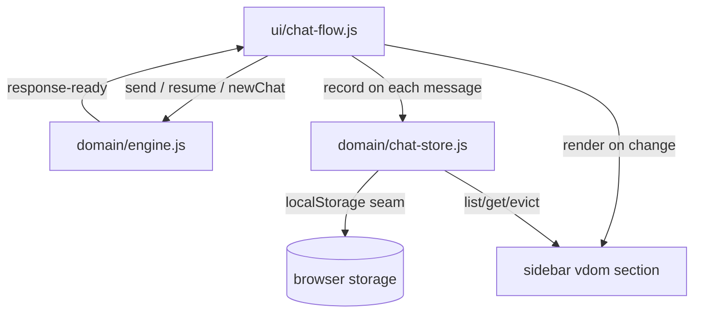

# Persisted Chats With Generated Titles - Plan

## Goal Capsule

- **Objective:** Users close the tab, come back later, and their real conversations are still in the sidebar under titles that say what each chat was about — the app behaves like it remembers them (Johnny insists he always does).
- **Means:** Persist live chats in browser storage once they clear a message threshold; derive a rule-based title from the conversation's dominant keyword; list them under the pinned pre-baked histories.
- **Product authority:** Parody chat app; the user is the visitor chatting with Johnny. Persistence must feel real; titles must stay in the app's voice.
- **Open blockers:** None.
- **Execution:** code.

---

## Product Contract

Product Contract unchanged from the requirements-only brainstorm.

### Summary

Real live chats persist across reloads and appear in the sidebar below the pinned pre-baked fake histories. A chat earns a sidebar entry at 3+ messages, titled from its dominant topic keyword with a Johnny garnish on hover, capped at 10 with oldest-first eviction. Reopening a saved chat resumes it as a live, continuable conversation.

### Requirements

**Persistence**

- R1. A live chat is persisted (and updated on every subsequent message) once it reaches 3 messages (user + AI combined); below the threshold nothing is stored.
- R2. Persisted chats survive page reloads and browser restarts via browser-local storage; no backend or account exists.
- R3. The sidebar shows persisted chats below the pre-baked fake histories, which remain pinned in their current positions.
- R4. At most 10 persisted chats are kept; when an 11th qualifies, the oldest is evicted.

**Titles**

- R5. Each persisted chat gets a plain, factual topic title derived rule-based from its dominant keyword (the response engine's routing categories: date, mama, hair, muscle, hello, or an extracted mention for default topics).
- R6. The title carries a Johnny-flavored garnish surfaced as the item's hover text (title attribute), e.g. "Workout routine — 100% bicep-related"; the visible label stays plain.
- R7. The title is assigned when the chat qualifies for persistence and does not change afterward even if the topic drifts.

**Resuming**

- R8. Clicking a persisted chat loads its full conversation into the chat surface and continues it as a live chat: further sends append to it, the no-repeat response memory applies across the resume boundary, and regenerate works on the loaded history.
- R9. Continued activity on a resumed chat updates the existing persisted entry (messages and, when applicable, eviction recency) rather than creating a duplicate.
- R10. "New Chat" starts a fresh unpersisted conversation as today; the previously active persisted chat remains stored unless evicted.

### Acceptance Examples

- AE1. User sends one message, gets one reply, reloads.
  - **Covers R1, R2.**
  - **When** the chat has fewer than 3 messages at reload, **then** no sidebar entry appears and nothing was stored.
- AE2. User has a 4-message hair chat, reloads.
  - **Covers R1–R3, R5, R6.**
  - **Given** the chat qualified at 3 messages and gained a fourth, **then** the sidebar shows it under the fakes with a plain hair-related title and a Johnny garnish on hover, containing all 4 messages.
- AE3. User reopens a saved 4-message chat and sends another message.
  - **Covers R8, R9.**
  - **Then** the new exchange appends to the same sidebar entry (no duplicate), and responses avoid lines already used before the reload.
- AE4. An 11th chat qualifies while 10 are stored.
  - **Covers R4.**
  - **Then** the oldest stored chat disappears from storage and the sidebar; the fakes are unaffected.
- AE5. Two chats about muscle exist; user opens the older one and continues it.
  - **Covers R9.**
  - **Then** that chat's recency updates so it is no longer the eviction candidate.

### Success Criteria

- Reload mid-conversation loses nothing above the persistence threshold; the e2e suite gains a reload-and-resume test.
- Titles are deterministic for a given dominant keyword (no randomization in the visible label).

### Scope Boundaries

- No delete/rename UI for saved chats — cap eviction is the only removal path.
- No export/import, no sync, no accounts.
- No changes to the pre-baked fake histories' content or behavior.
- No LLM-generated titles — rule-based derivation only (no backend, no new dependencies).

---

## Planning Contract

Product Contract preserved verbatim; restructured: none.

### Key Technical Decisions

- KTD1. A new DOM-free module `src/domain/chat-store.js` owns persistence: threshold check, title assignment, cap/eviction, and a storage-backend seam (`localStorage` in the browser, an injectable map for tests). Governs R1–R4. Pattern follows `src/domain/histories.js` export style.
- KTD2. Title derivation lives in `src/domain/titles.js`: routes the conversation through the same keyword regexes as `responses.js` (imported or re-exported, not duplicated) to find the dominant category, falling back to `extractMention()` on the first user message; garnish templates are a static per-category map. Governs R5–R7.
- KTD3. `src/domain/responses.js` exposes its no-repeat state (`seenIndices` equivalents) via serializable export/restore functions — seams only, pool content untouched. The engine's `loadHistory` splits into fake-load (read-only, as today) and `resumeChat(chat)` (restores conversation memory, sets the active persisted id). Governs R8.
- KTD4. Sidebar rendering gains a persisted-chats section under the fakes, built with the vdom (`src/vdom/`) using keyed items; ids namespaced (`p:<uuid>` vs fake data-ids) so event delegation routes loads correctly. The `220ms switching` choreography applies to persisted loads too (UI-side, per the engine-plan KTD4 precedent). Governs R3, R8.
- KTD5. The engine emits its message stream to the store on every `response-ready` (and user send), keeping the store a passive subscriber — the engine does not import the store; wiring happens in `ui/chat-flow.js`. Governs R1, R9, R10.

### High-Level Technical Design

Data flow (one direction; the store never calls back into the engine):

### Implementation Constraints

- `domain/` stays DOM-free (AGENTS.md module boundary rule); `localStorage` access sits behind the injectable seam.
- Sidebar persists performance directives: keyed vdom items, event delegation on the parent, no per-item listeners.

---

## Implementation Units

### U1. Chat store + title derivation (`src/domain/chat-store.js`, `src/domain/titles.js`)

- **Goal:** DOM-free persistence module with threshold, deterministic titles, garnish, cap/eviction, injectable storage.
- **Requirements:** R1–R7 (AE1, AE2, AE4).
- **Dependencies:** None (branches from the vdom work only for the shared repo state).
- **Files:**
  - Create `src/domain/chat-store.js`
  - Create `src/domain/titles.js`
  - Create `src/domain/chat-store.test.js`
- **Approach:**
  1. `chat-store.js`: `recordMessage(chatId, role, text)` no-ops below 3 messages; `titleChat()` assigns once via `titles.js`; `listChats()` returns newest-first; eviction drops oldest when an 11th qualifies; `getChat(id)`; `resumeState(id)` returns the conversation + response-memory snapshot. Storage seam: `createChatStore(storage)` with a localStorage adapter in `ui/`, in-memory map in tests.
  2. `titles.js`: `deriveTitle(messages)` — count routing-category hits across user messages (same regexes as `responses.js`), pick dominant; map category → plain label (e.g. "Dating advice", "Mama stories", "Hair care"); fallback: capitalize `extractMention(firstUserMessage)` or "Chat with Johnny". `garnishFor(category)` returns the hover string. Deterministic: no `Math.random`.
  3. Response-memory snapshot per KTD3 pairs with `resumeState` — this unit defines the store's shape only; engine restore is U2.
- **Patterns to follow:** export style of `src/domain/histories.js`; pure-function shape of `src/domain/responses.js`.
- **Test scenarios:**
  - Covers AE1. `recordMessage` twice → `listChats()` empty, nothing in storage.
  - Covers AE2. Third message recorded → chat listed with deterministic title + garnish; fourth message updates the same entry.
  - Covers AE4. Recording an 11th qualifying chat evicts the oldest from storage and list.
  - Title dominance: hair keyword in 2 of 3 user messages beats one date mention; tie → first-seen category wins deterministically.
  - Fallback title: default-pool conversation with extractable mention → capitalized mention; no mention → "Chat with Johnny".
  - Title immutability (R7): after assignment, later messages with a different dominant keyword do not change it.
  - Storage seam: in-memory adapter only — no `window`/`document` referenced (grep-verifiable).
- **Verification:** `npm test` green with new suite; `grep -rn 'localStorage' src/domain/` returns only the injectable adapter mention, none in module top-level.

### U2. Engine resume path + response-memory serialization (`src/domain/engine.js`, `src/domain/responses.js`)

- **Goal:** Reopening a persisted chat continues it live with no-repeat memory across the reload boundary.
- **Requirements:** R8 (R9 partial).
- **Dependencies:** U1.
- **Files:**
  - Modify `src/domain/responses.js` (serialize/restore seams for `seenIndices` + `arroganceLevel`)
  - Modify `src/domain/engine.js`
  - Modify `src/domain/engine.test.js`
- **Approach:**
  1. `responses.js`: `exportConversationState()` / `restoreConversationState(snapshot)` — pure accessors over `seenIndices` and `arroganceLevel`; `resetConversation` unchanged.
  2. `engine.js`: `resumeChat(chat)` — invalidates session (existing guard), restores response memory from the snapshot, emits a `history-loaded`-shaped event carrying the conversation (the UI reuses its render path including the 220ms choreography), and marks the active chat as a live continuable id distinct from fake ids.
  3. Subsequent `send` appends to the resumed chat id instead of clearing to null; `getLastUserText` seeded from the resumed conversation's last user message so regenerate works (R8).
- **Test scenarios:**
  - Resume + send: response never repeats a line the snapshot marks served (covers the AE3 memory claim at unit level).
  - Resume + regenerate: regenerates the last user message from the resumed conversation.
  - Resume emits `history-loaded` with the full conversation; session-invalidated fires first.
  - `send` after `startNewChat` still clears the chat id (R10 unchanged).
- **Verification:** `npm test` green; no DOM references added to `domain/`.

### U3. Sidebar rendering + wiring (`src/ui/`)

- **Goal:** Persisted chats render under the fakes, load/resume correctly, and the store is fed passively.
- **Requirements:** R2, R3, R9, R10 (AE3, AE5).
- **Dependencies:** U1, U2.
- **Files:**
  - Modify `src/ui/chrome.js`
  - Modify `src/ui/chat-flow.js`
  - Create `src/ui/sidebar-chats.js` (vdom section for persisted chats)
  - Modify `index.html` (empty container for the persisted section)
- **Approach:**
  1. `sidebar-chats.js`: vdom-rendered section (KTD4) with keyed `.history-item` entries (id `p:<uuid>`), plain label + `title` attribute garnish; re-render on store change; delegation stays on `#chat-history`'s parent covering both sections.
  2. `chat-flow.js`: route `p:`-prefixed ids to `engine.resumeChat(store.getChat(id))`, others to the existing fake `loadHistory`; wire `response-ready` and send to `store.recordMessage` for the active persisted chat (KTD5), bumping recency on resume (AE5).
  3. `chrome.js`: create the localStorage-backed store at init, pass to sidebar + chat-flow; initial render reads storage (R2).
- **Test scenarios:** Test expectation: none — covered by U1/U2 units plus the e2e below; this unit is wiring.
- **Verification:** `npm run build` green; persisted section renders below fakes with delegation intact.

### U4. e2e reload-and-resume + docs

- **Goal:** Prove the persistence loop end-to-end and update docs.
- **Requirements:** R1–R10 (AE1–AE5 at the browser level for AE2/AE3).
- **Dependencies:** U3.
- **Files:**
  - Modify `tests/e2e/chat.spec.js`
  - Modify `AGENTS.md`
- **Approach:**
  1. New e2e: chat to 3 messages → `page.reload()` → sidebar shows the saved chat under the fakes → click it → conversation visible → send another message → no duplicate entry. Sub-2-message chat reload leaves no entry (AE1).
  2. AGENTS.md: file tree (`chat-store.js`, `titles.js`, `sidebar-chats.js`), architecture section for persistence, module boundary note that `chat-store` storage access is seam-injected.
- **Test scenarios:** Test expectation: none — this unit runs the suites.
- **Verification:** `npm test`, `npm run build`, Chromium+Firefox e2e green (WebKit pending host deps); AGENTS.md tree matches layout.

---

## Verification Contract

- `npm test` — Vitest suites including `chat-store.test.js` and extended `engine.test.js`.
- `npm run build` — production build succeeds.
- `npm run test:e2e -- --project=chromium --project=firefox` — including the new reload-and-resume test (WebKit/mobile blocked by host deps, noted in the vdom commit).
- Structural greps: no `localStorage`/`document`/`window` at `src/domain/` module top-level.

## Definition of Done

- All Verification Contract gates green.
- Every requirement R1–R10 traceable to a unit; AE1–AE5 covered by unit or e2e tests.
- Cleanup: no dead exports, no leftover debug logging.
- AGENTS.md reflects the persistence layer.
