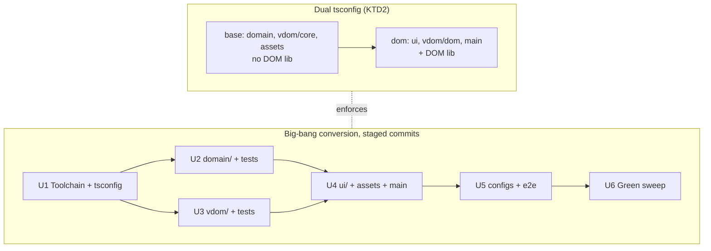

## Goal Capsule

- **Objective:** The bravochat codebase is fully modernized to 2026 standards: every source and test file is TypeScript, the toolchain runs current majors, and type safety covers the layered architecture — with zero change to app behavior.
- **Means:** Big-bang JS→TS conversion of all 19 files plus configs, typechecked by TypeScript 7 (native Go compiler), accompanied by an ES2024+ idiom pass (KTD1–KTD5).
- **Product authority:** Product behavior, UI, and features are frozen. This work owns toolchain, language, and code idioms only.
- **Open blockers:** None.
- **Execution profile:** One coordinated change landed as staged per-layer commits; stop if any test suite diverges from its pre-migration result.
- **Tail ownership:** Ends when the Verification Contract passes; no CI watch beyond the repo's existing workflows.

## Product Contract

### Summary

Convert the entire vanilla-JS codebase to TypeScript under TypeScript 7's native compiler, adopt the strict-plus tsconfig profile, refresh the toolchain to current majors, and modernize in-code idioms to ES2024+ — one coordinated change, delivered in staged units per layer.

*Product Contract preservation: unchanged from the brainstorm; no restructuring.*

### Problem Frame

The repo is deliberately frameworkless vanilla ES modules with zero type safety and a 2025-era toolchain baseline. The layered architecture (`domain/` → `vdom/` → `ui/`) is an explicit design asset that types can lock in, and TypeScript 7.0.2's GA (July 2026) makes the native compiler a stable, ~10x-faster option for plain `.ts` + Vite codebases like this one. The cost of staying untyped grows with every new module; the cost of converting now is low at 19 files with colocated per-layer tests.

### Key Decisions

- **TypeScript 7 (`tsgo`) as the typechecker.** Vite keeps transpiling; type checking is decoupled via a dedicated `typecheck` script. This codebase has no Compiler API, ts-jest, or Vue/Svelte dependencies, so TS 7.0's known gaps don't apply. (session-settled: user-directed — chosen as the stated target.)
- **Big-bang conversion, not incremental.** All 19 files plus configs convert in one coordinated change; the repo is small enough and per-layer tests keep it green. (session-settled: user-directed — chosen over incremental layer-by-layer with `allowJs`.) Governs R2.
- **Strict-plus profile.** `strict` (TS 7 default) + `noUncheckedIndexedAccess` + `verbatimModuleSyntax`, ES2024 target, `moduleResolution: "bundler"`. (session-settled: user-directed — chosen over strictest-possible.) Governs R3.
- **No linter until TypeScript ≥ 7.2.** Lint/format tooling stays out; the ecosystem needs time to catch up to the native compiler. Governs R6.
- **AGENTS.md dependency rule amended.** TypeScript enters as an allowed devDependency; the no-extra-deps rule otherwise stands. Governs R7.
- **One plan, staged units.** TS conversion, toolchain refresh, and idiom modernization are coupled enough to plan together, with per-stage implementation units. (session-settled: user-directed — chosen over splitting into follow-up brainstorms.)

### Requirements

**Conversion and typing**

- R1. Every `.js` file under `src/` (including colocated test files) is converted to `.ts`, and `src/main.js`'s entry reference in `index.html` is updated to match.
- R2. The conversion lands as one coordinated change: after it, no `.js` source files remain and `allowJs` is not needed.
- R3. The tsconfig enforces `strict`, `noUncheckedIndexedAccess`, `verbatimModuleSyntax`, `moduleResolution: "bundler"`, and ES2024 target, and `npm run typecheck` passes clean.
- R4. The layered module boundary is expressed in types: the DOM-free guarantee of `domain/`, `vdom/core`, and `assets/` is preserved, and shared data shapes (vnodes, chat messages, engine events, chat-store records) have named types.

**Toolchain**

- R5. Dev toolchain runs current stable majors: Vite 8, Vitest 4, Playwright current, TypeScript 7 — with unit and e2e suites passing on the converted code.
- R6. No lint or format tooling is added; revisit when TypeScript 7.2 is available.

**Process and docs**

- R7. `AGENTS.md` is updated: TypeScript added to the allowed devDependencies, file-structure listing reflects `.ts` files, and the layering rule's module-boundary wording covers types.
- R8. During conversion, code is modernized to ES2024+ idioms where it improves clarity (explicit return types on exported functions, modern syntax), without changing behavior.

### Acceptance Examples

- AE1. **Covers R1–R3.** Given the converted repo, when `npm run typecheck` and `npm test` run, both pass with zero `.js` files remaining under `src/` and the strict-plus flags active in `tsconfig.json`.
- AE2. **Covers R4, R5.** Given a temporary edit that makes a `domain/` module import a DOM global, when `npm run typecheck` runs, it fails — the DOM-free boundary is enforced by types, not convention.
- AE3. **Covers R5, R8.** Given the converted repo, when `npm run build` and `npm run test:e2e` run, the production build and all e2e specs pass identically to before the migration.

### Success Criteria

- App behavior is bit-identical: all Vitest and Playwright suites pass without test-logic changes beyond typing.
- `npm run typecheck` completes near-instantly (TS 7 native compiler on a 19-file repo).

### Scope Boundaries

Non-goals:

- Lint/format tooling (deferred until TS ≥ 7.2)
- Any user-facing behavior, UI, or styling change
- New features or response-engine content changes
- Restructuring the folder/layer architecture

#### Deferred to Follow-Up Work

- Revisit lint/format tooling once TypeScript 7.2 ships (per R6).
- Revisit `isolatedDeclarations` + explicit return-type enforcement repo-wide if the project ever emits declaration files.

### Dependencies / Assumptions

- TypeScript 7.0.2 GA (native Go compiler, July 2026) supports this codebase's plain `.ts` shape; no Compiler API consumers exist in the toolchain.
- Vitest and Playwright typecheck-agnostically transpile `.ts` test files (esbuild-based), so no runner swap is needed.

### Sources / Research

- TypeScript 7.0 GA announcement and upgrade guidance (InfoQ, ishu.dev, July 2026): strict default, `moduleResolution: "bundler"`, Compiler API gaps in 7.0 with Strada API in 7.1 — confirms lint deferral and clean fit for this repo.
- Existing plans under `plans/` and `docs/plans/` cover prior refactors; none overlap this migration.
- Repo: 19 `.js` files across `src/domain`, `src/vdom`, `src/ui`, `src/assets`; devDeps Vite 8 / Vitest 4 / Playwright 1.62; `package.json` currently `"type": "commonjs"` while all source is ESM.

---

## Planning Contract

### Key Technical Decisions

- KTD1. **Typecheck via `tsgo`, decoupled from Vite.** Install TypeScript 7 as a devDependency; add `npm run typecheck` invoking the native compiler with `--noEmit`. Vite's transpile path is untouched, so no Vite plugin or checker middleware is added. Instantiates the TypeScript 7 Key Decision for R3, R5.
- KTD2. **Dual tsconfig split enforces the DOM-free boundary.** A base config (`tsconfig.json`, no DOM lib, `moduleResolution: "bundler"`, strict-plus flags) covers `src/domain`, `src/vdom/core.ts`, `src/assets`, and their tests; a second config extending it (adding `"lib": ["ES2024", "DOM"]`) covers `src/ui`, `src/vdom/dom.ts`, and `src/main.ts`. `typecheck` runs both. This is what makes AE2 fail-on-DOM-import real rather than aspirational. Governs R4, AE2.
- KTD3. **Types colocated with their owning module.** Engine event and command types live in `src/domain/engine.ts`, vnode types in `src/vdom/core.ts`, chat-store record types in `src/domain/chat-store.ts`, message shapes in `src/domain/histories.ts`/`src/domain/responses.ts`. No central `types/` folder — dependencies stay one-way per the layering rule. (session-settled: user-approved — chosen over a central types folder: keeps layer ownership explicit.) Governs R4.
- KTD4. **`package.json` switches to `"type": "module"`.** All source is already ESM; `"commonjs"` survives only by Vite's config bundling. The switch aligns with the 2026 Vite/Vitest standard and lets `vite.config.ts` / `playwright.config.ts` load natively. Caught in verification if any tool misbehaves. (session-settled: user-approved — chosen over keeping `"commonjs"`: correctness over inertia.) Governs R5.
- KTD5. **Configs and e2e specs convert too.** `vite.config.js` → `vite.config.ts`, `playwright.config.js` → `playwright.config.ts`, `tests/e2e/chat.spec.js` → `.ts`. "Whole codebase" is read literally. (session-settled: user-approved — chosen over src-only conversion: matches the modernization goal.) Governs R1, R5.
- KTD6. **JSDoc type comments become annotations and are then removed where redundant.** The codebase's existing JSDoc types are the conversion seed; after moving them into signatures, duplicated `@type`/`@param` blocks are deleted (doc prose stays). `verbatimModuleSyntax` drives `import type` usage for type-only imports. Governs R8.

### High-Level Technical Design

Type ownership flows one way: `domain/` exports its own event/message/store types; `vdom/core.ts` exports the `VNode` discriminated union (`element`/`text`/`raw`); `ui/` imports both and owns nothing downstream. The DOM-free files compile against the DOM-less base config, so a stray `document` reference in `domain/` is a type error (AE2).

### Assumptions

- The TS 7 npm package exposes the native CLI under the name the current GA documents; if the binary name differs at install time, the `typecheck` script uses the documented invocation. Resolved during U1.
- Vitest 4 and Playwright current pick up `.ts` specs and configs without extra plugins. Verified in U1/U5; failure would be a plan-time flag, not a silent fallback.

---

## Implementation Units

### U1. Toolchain and tsconfig foundation

- **Goal:** TypeScript 7 is installed and typecheckable before any file converts.
- **Requirements:** R3, R5, R7 (dependency-rule part)
- **Dependencies:** none
- **Files:** `package.json`, `tsconfig.json` (new), `tsconfig.dom.json` (new), `AGENTS.md`
- **Approach:**
  1. Add TypeScript 7 devDependency; add `"typecheck"` script per KTD1; switch `"type": "module"` per KTD4; bump `engines.node` if TS 7 requires newer than 20.
  2. Create both tsconfigs per KTD2 with the strict-plus flags of R3: `strict`, `noUncheckedIndexedAccess`, `verbatimModuleSyntax`, `moduleResolution: "bundler"`, `target: ES2024`, `noEmit`.
  3. Amend `AGENTS.md`: TypeScript allowed devDependency, `.ts` in file-structure listing, layering-rule wording for types (R7).
- **Patterns to follow:** existing `vite.config.js` minimalism — no options beyond what R3/KTD2 name.
- **Test scenarios:** Test expectation: none — pure config scaffolding; proven by U6's full-suite run.
- **Verification:** `npm run typecheck` executes (may report zero files initially); `npm test` and `npm run dev` still work on the untouched JS.

### U2. Convert domain layer and tests

- **Goal:** `src/domain/` is fully typed TypeScript with named shared shapes.
- **Requirements:** R1, R4, R8 (covers AE1, AE2 groundwork)
- **Dependencies:** U1
- **Files:** `src/domain/responses.ts`, `src/domain/responses.test.ts`, `src/domain/engine.ts`, `src/domain/engine.test.ts`, `src/domain/chat-store.ts`, `src/domain/chat-store.test.ts`, `src/domain/titles.ts`, `src/domain/histories.ts`
- **Approach:** Rename each module; lift JSDoc types into signatures per KTD6. Introduce named types: engine `EngineEvent` discriminated union (`typing-started`, `response-ready`, `session-invalidated`, `chat-reset`, `history-loaded`), `ConversationMessage` (`{ text, sender: 'user' | 'ai' }`), `PersistedChat`, chat-store record type, title/category types in `responses.ts`/`titles.ts`. Keep module-level state typed via explicit declarations. Run the domain Vitest suites after conversion; they must pass without logic edits.
- **Execution note:** Convert-then-run per file pair (module + its test) so type errors surface in small batches.
- **Patterns to follow:** the existing JSDoc contracts in `src/domain/engine.ts` are the intended signatures.
- **Test scenarios:**
  - All existing engine tests (race guards, scheduling ranges, no-op guards, event emission) pass unchanged in logic — Covers AE1.
  - All existing chat-store tests (threshold, eviction, round-trip) pass unchanged in logic.
  - All existing responses tests (category routing, greeting length guard, fallback, pool integrity) pass unchanged in logic.
  - Covers AE2. A scratch import of a DOM global into a domain module fails `typecheck` under the base config.
- **Verification:** `npm run typecheck` clean; `npm test -- src/domain` green.

### U3. Convert vdom layer and tests

- **Goal:** `src/vdom/` is typed; the vnode model becomes a discriminated union.
- **Requirements:** R1, R4, R8
- **Dependencies:** U1
- **Files:** `src/vdom/core.ts`, `src/vdom/core.test.ts`, `src/vdom/dom.ts`
- **Approach:** Define exported `VNode` union (`VElement` | `VText` | `VRaw`) and `PatchOp` type replacing the current `@typedef`; type `h`, `diffChildren`, `diffProps`, `sameKind` signatures. `dom.ts` types DOM renderer entry points (`createEl`, `patchEl`, `patchChildren`, `ownContainer`) against `VNode`. `noUncheckedIndexedAccess` will surface in `diffChildren`'s index accesses — handle with guards, not non-null assertions. `core.test.ts` op-count benchmarks must keep passing with identical op counts.
- **Patterns to follow:** JSDoc contracts in `src/vdom/core.js`.
- **Test scenarios:**
  - Existing core tests pass, including the append = 1 insert and reverse = 0 DOM-churn benchmarks — Covers AE1.
  - Edge: keyed/unkeyed mixed diff produces the same op list as before (existing tests encode this; no expected-value edits).
- **Verification:** `npm run typecheck` clean; `npm test -- src/vdom` green.

### U4. Convert ui layer, assets, and entry

- **Goal:** `src/ui/`, `src/assets/`, and `src/main.js` are TypeScript; `index.html` points at the new entry.
- **Requirements:** R1, R4, R8
- **Dependencies:** U2, U3
- **Files:** `src/ui/dom.ts`, `src/ui/messages.ts`, `src/ui/chat-flow.ts`, `src/ui/sidebar-chats.ts`, `src/ui/chrome.ts`, `src/ui/background.ts`, `src/assets/avatar.ts`, `src/main.ts`, `index.html`
- **Approach:** Type element lookups (`ui/dom.ts` owns references — non-null assertions only at the single lookup point, narrowing thereafter), canvas context in `background.ts`, sparkle/shape state, message-list model feeding the vdom render path. Update `index.html` script src to `/src/main.ts`. This layer compiles under `tsconfig.dom.json` per KTD2.
- **Patterns to follow:** `ui/dom.js`'s existing lookup helpers; `messages.js`'s vnode data model.
- **Test scenarios:**
  - Test expectation: none unit-level — `ui/` has no Vitest suite today and none is added; correctness is proven by U5's e2e suite (behavior frozen per R8).
- **Verification:** `npm run typecheck` clean across both configs; `npm run dev` boots and the welcome screen renders.

### U5. Convert configs and e2e suite

- **Goal:** Vite/Playwright configs and the e2e spec are TypeScript; the e2e suite passes against the converted app.
- **Requirements:** R1, R5 (covers AE3)
- **Dependencies:** U4
- **Files:** `vite.config.ts` (from `.js`), `playwright.config.ts` (from `.js`), `tests/e2e/chat.spec.ts` (from `.js`)
- **Approach:** Straight renames with `defineConfig` types already inferred; keep options identical (sourcemaps, browsers, preview server). Per KTD5. Delete the old `.js` configs so Vite doesn't prefer them.
- **Test scenarios:**
  - All existing e2e specs pass: welcome screen + chips, send/receive flow, history loading, persisted-chat sidebar behavior — Covers AE3.
  - `npm run build` produces a sourcemapped production bundle — Covers AE3.
- **Verification:** `npm run test:e2e` green; `npm run build` succeeds.

### U6. Green sweep and cleanup

- **Goal:** The whole migration is provably complete and clean.
- **Requirements:** R2, R3, R8 (covers AE1, AE2, AE3)
- **Dependencies:** U1, U2, U3, U4, U5
- **Files:** all of the above; no new files
- **Approach:**
  1. Confirm zero `.js` files remain under `src/` and `tests/` (R2); `git grep -l '\.js"' index.html` is empty.
  2. Remove JSDoc blocks that now duplicate signature types (KTD6); keep prose docs.
  3. ES2024 idiom pass (R8): `??`/`?.` where it simplifies, explicit return types on all exports, `import type` for type-only imports (verbatimModuleSyntax enforces).
  4. Full verification run per the Verification Contract.
- **Test scenarios:**
  - Covers AE1, AE2, AE3. Full command set of the Verification Contract passes in sequence.
- **Verification:** See Verification Contract; plus a manual `npm run preview` spot-check of send/regenerate/new-chat/history-load flows.

---

## Verification Contract

| Command | Proves | Units |
|---|---|---|
| `npm run typecheck` | R3 strict-plus clean across both tsconfigs; near-instant (TS 7) | U1–U6, AE1 |
| `npm test` | Unit suites green, logic unchanged | U2, U3, AE1 |
| `npm run build` | Production build with sourcemaps | U5, AE3 |
| `npm run test:e2e` | Behavior bit-identical in real browsers | U4, U5, AE3 |
| `npm run preview` + manual smoke | App usable end-to-end | U6 |

Gate: all commands pass in one sequence with no `.js` source files remaining (R2). Any test-logic edit beyond typing is a defect against the frozen-behavior authority, not a fix.

## Definition of Done

- Every requirement R1–R8 holds; AE1–AE3 verified via the table above.
- No `.js` files under `src/` or `tests/`; `index.html` entry is `/src/main.ts`.
- `AGENTS.md` reflects TypeScript in allowed devDependencies, `.ts` file tree, and typed layering wording.
- Abandoned conversion experiments (alternate configs, suppressed errors via `any` escapes, leftover JSDoc duplicates) are removed, not left in the diff.
- No lint tooling added (R6); deferred items recorded under Deferred to Follow-Up Work.
