## Goal Capsule

- **Objective:** The bravochat codebase reads as idiomatic 2026 TypeScript end to end: modern typing patterns, a current compile target, and an architecture refactored where refactoring makes the app demonstrably better — while the Johnny Bravo product feels identical to use.
- **Means:** A full modernization pass over `src/` — modern typing patterns (`satisfies`, `as const`, discriminated unions, utility typings), an `esnext` compile target, and structural refactorings where a modern architecture is genuinely cleaner (KTD1, KTD2).
- **Product authority:** Product behavior, persona, content, UX flows, and visual identity are frozen as experienced by the user, except where a justified R5 improvement changes it (the e2e suite is the arbiter); everything behind them (module structure, state shape, vdom design, runtime code) may change on merit. Predecessor: `docs/plans/2026-08-25-2116-refactor-modernize-typescript-7-plan.md` (the JS→TS conversion) — this plan owns what comes after it.
- **Open blockers:** None.
- **Execution profile:** Staged per-layer commits in unit order; stop if any test suite diverges from its current passing result (except spec updates matching intended improvements per R5).
- **Tail ownership:** Ends when the Verification Contract passes; no CI watch beyond the repo's existing workflows.

## Product Contract

### Summary

Modernize the TypeScript codebase to TS 7-era architecture: modern typing patterns across all modules, a current compile target (`esnext`), and structural refactorings where the result is less code, clearer invariants, or better performance. The app as the user experiences it stays unchanged.

### Problem Frame

The JS→TS conversion (see predecessor plan) landed the language, strict-plus config, and a clean layer split — but the code inside still reads as "typed JavaScript": boolean flag pairs instead of tagged state, `Record` lookups without `satisfies`, no exhaustiveness leverage from the type system. The cost shape: invariants that live in comments rather than types, and data tables whose literal-key inference is thrown away by annotation.

### Key Decisions

- **Full modern pass over conservative polish** (session-settled: user-directed — chosen over conservative polish and polish-plus-unions tiers: user wants all modern typing tiers applied, accepting type-level density). Governs R1–R4.
- **Current-target compile bump, resolved to `esnext`** (session-settled: user-directed — ES2026 was chosen first, then redirected to `esnext` after research showed TS 7.0.2 has no `es2026` target/lib option; `esnext` keeps the codebase current without waiting for TS 7.1). Governs R2.
- **Runtime behavior may change for the better** (session-settled: user-directed — chosen over frozen behavior: improvements ride on merit; the e2e suite is the arbiter, and spec updates to match improvements are in scope). Governs R5.
- **Major refactorings allowed for TS 7 modern architecture** (session-settled: user-directed — chosen over incremental patching: a bigger diff is accepted for an idiomatic-TS-7 codebase). Governs R4, R5.
- **The vdom may be reshaped or redesigned** — both arms were open at brainstorm; planning resolves to refactor-in-place (KTD2). Governs R4.
- **Readability is the gate on every change** — a typing or syntax pattern that makes a site harder to read than the current code is left alone. Governs R1–R5.
- **"Genuinely better" means at least one of: less code, clearer invariants, better performance** — novelty alone does not justify a change. Governs R4, R5.
- **AGENTS.md layering rules still bind** — `domain/`, `vdom/core.ts`, `assets/` stay DOM-free; `ui/ → vdom/ → domain/` holds. No deviation was found worth arguing during planning; one may still be proposed by the implementer with justification. Governs R4.

### Requirements

**Typing modernization**

- R1. Apply modern typing patterns where they fit: `satisfies` on lookup tables (`responses`, category label/garnish maps), `as const`/const type parameters on frozen data (`chatHistories`, category maps), template literal types and `NoInfer` at sites where they add real checking value.
- R2. Move both tsconfigs to the `esnext` target and current libs, and adopt modern runtime syntax where it earns its place — per the readability gate.
- R3. Replace boolean flag-pair state in `src/domain/engine.ts` with discriminated unions so illegal state combinations are unrepresentable at the type level.
- R4. Refactor module architecture where a modern shape is cleaner — including the vdom, resolved to refactor-in-place per KTD2 — with each structural change justified against the "genuinely better" bar.

**Runtime and behavior**

- R5. Runtime behavior changes are permitted when they improve the app (simpler code, better performance, stronger correctness); each such change is identifiable and justified in the implementation, and Playwright specs are updated to match intended improvements.

**Verification**

- R6. The existing Vitest unit suites and Playwright e2e suites pass after the pass, with any spec changes limited to those matching intended behavior improvements per R5.
- R7. `npm run typecheck` passes for both configs; the DOM-free boundary (base tsconfig compiling `src/domain`, `src/vdom/core.ts`, `src/assets` without the DOM lib) is preserved.

### Key Flows

- F1. **Refactor flow per module:** typecheck → unit tests → next module; e2e at structural checkpoints (engine, vdom) rather than after every file. **Covers R1–R7.**

### Acceptance Examples

- AE1. **When** the response lookup tables are annotated with `satisfies`, **then** adding a response under a misspelled category key fails to compile, and existing literal-key inference at call sites is unchanged. **Covers R1.**
- AE2. **When** the engine holds a pending response and a new chat starts, **then** the discriminated-union state machine makes "responding without a scheduled callback" unrepresentable, and the existing session-token race-guard tests still pass. **Covers R3, R6.**
- AE3. **When** a modern runtime feature replaces older code, **then** the feature is exercised by an existing or updated e2e spec in Chromium, Firefox, and WebKit, and the replaced code is deleted, not left alongside. **Covers R2, R5, R6.**

### Success Criteria

- A cold reader fluent in 2026 TypeScript finds no "typed JavaScript" smells: no flag-pair state, no annotation that discards literal inference where `satisfies` would preserve it.
- Total code does not grow; a pass that adds net lines without removing flag code or duplication has failed its own bar.
- The app is indistinguishable from the current build in normal use (persona, flows, perf feel).

### Scope Boundaries

- No new dependencies — Vitest/Playwright/TypeScript/Vite/@types/node stay the toolchain; a proposed architecture that needs React or a state library is rejected on that evidence.
- No UX, theme, content, or persona changes.
- No CI/CD, deployment, or hosting changes.

### Dependencies / Assumptions

- TS 7.0.2 supports `esnext` target and the `esnext.*` lib fragments including `esnext.disposable` (verified locally: `npx tsc --showConfig` accepts them; `es2026` is rejected and ships in TS 7.1 per the iteration plan).
- Vite 8/esbuild transpiles `esnext` source including `using` declarations without plugin changes.
- Playwright's bundled browsers support the runtime features adopted; the e2e suite is the arbiter.

### Sources / Research

- `docs/plans/2026-08-25-2116-refactor-modernize-typescript-7-plan.md` — predecessor JS→TS conversion; establishes the strict-plus profile and layering this pass builds on.
- `AGENTS.md` — layering rules, module boundary rule, performance directives, comment style.
- `tsconfig.json` / `tsconfig.dom.json` — current ES2024/strict-plus baseline both configs move from.
- TypeScript 7.1 iteration plan (microsoft/TypeScript#63703) — `es2026` target/lib lands post-7.0; motivates the `esnext` resolution in Key Decisions.

---

## Planning Contract

### Key Technical Decisions

- KTD1. **Compile config: `target: "esnext"`, `lib: ["esnext", ...dom]`, keep `strict` + `noUncheckedIndexedAccess` + `verbatimModuleSyntax` in both tsconfigs.** (session-settled: user-directed — chosen over es2025+disposable and waiting for TS 7.1: `esnext` stays current without a second bump.) Instantiates the target decision governing R2. Because `verbatimModuleSyntax` + `moduleResolution: bundler` already hold, no module settings change; `types: ["node"]` stays in the base config — `src/domain/responses.test.ts` (inside its include set) imports `node:fs` to read `index.html`, and omitting the option would auto-include @types/node anyway.
- KTD2. **vdom: refactor in place, do not redesign.** The mini-vdom (`src/vdom/core.ts` ~150 lines + `src/vdom/dom.ts`) is small, DOM-free in core, benchmarked by `core.test.ts`, and already uses a discriminated vnode union. A from-scratch redesign would trade tested, benchmarked code for novelty — it fails the "genuinely better" bar. The refactor modernizes typing in place: const type parameters on diff functions where inference benefits, `satisfies` on op shapes, exhaustive `switch` narrowing on `type` instead of chained `if` type checks, and removes `?? null` fallbacks the strict types make unreachable where they truly are. Governs R4.
- KTD3. **Engine state becomes a single discriminated-union variable, not scattered flags.** Replace `isResponding` + `currentChatId` + `resumed` + `lastUserText` with one tagged state: `{ kind: 'idle' } | { kind: 'awaiting-response'; token: number; lastUserText: string } | { kind: 'viewing'; chatId: string | null; resumed: boolean; lastUserText: string }` (final shape is the implementer's call; the invariants to enforce are that "responding" always carries the token and the last user text, and that the viewing context — chatId, resumed, lastUserText — survives send() and the response firing, because `getCurrentChatId()`/`isResumedChat()`/`getLastUserText()` are read while responding and after the reply lands, e.g. by `ui/chat-flow.ts`'s response-ready handler and the regenerate flow). `sessionToken` remains the race-guard mechanism — the union holds the token captured at send time rather than a second module-level counter comparison, or keeps the counter if that reads better; readability gate decides. Public getters keep their signatures so `ui/` call sites are unchanged. Governs R3.
- KTD4. **`ResponseCategory` derives from the data, not the other way.** `responses` gets `as const` (or `satisfies Record<ResponseCategory, readonly string[]>`), and `ResponseCategory = keyof typeof responses` so adding a category is a one-site edit; the category tables in `titles.ts` switch to `satisfies` with `Record<Exclude<ResponseCategory, 'default'>, string>`-style keys so a new category forces its label/garnish entries at compile time. Governs R1.
- KTD5. **`using` and resource-shaped syntax: evaluated, expected no-home.** No module holds a resource with deterministic disposal (event listeners are app-lifetime; the sparkle rAF loop self-stops already). If implementation finds a genuine disposal seam (e.g. per-chat listener lifecycles), `using` may be applied there under the readability gate; otherwise the plan does not force it. Governs R2.
- KTD6. **UI layer pass is typing-only unless a flag-pair or duplication surfaces.** `src/ui/*` and `src/vdom/dom.ts` get the `satisfies`/narrowing pass; no wiring changes — `chat-flow.ts`, `messages.ts`, `chrome.ts` orchestration is correct and tested. R5 (behavior improvements) applies where a modern API genuinely simplifies (e.g. `Object.groupBy` if any grouping site exists, `Array.prototype.findLast` replacing `[...arr].reverse().find(...)` in `engine.ts`/`resumeChat` — that one is real and lands in U3). Governs R4, R5.

### Assumptions

- The Vitest suites (`core.test.ts`, `engine.test.ts`, `responses.test.ts`, `chat-store.test.ts`) assert on behavior and events, not module-internal state shape, so KTD3's refactor does not break them. If a test does reach into internals, updating that test is in scope.
- `esnext.disposable` in the base (DOM-free) config does not pull DOM types; verify in U1 that the DOM-free boundary check still holds per R7.

### High-Level Technical Design

Engine state machine after U3 (final state names are the implementer's call; the transitions and invariants are the contract):

```mermaid
stateDiagram-v2
    [*] --> Idle
    Idle --> Awaiting : send()/regenerate() — captures token + lastUserText
    Awaiting --> Idle : response fires (token matches) — viewing context survives
    Awaiting --> Idle : session invalidated — callback dropped
    Idle --> Viewing : loadHistory()/resumeChat() — carries chatId
    Viewing --> Awaiting : send() — appends when resumed; chatId/resumed carried
    Viewing --> Idle : startNewChat()
```

Invariants enforced by the union: only `Awaiting` can be responding, and it always carries the captured token and the last user text; the viewing context (chatId, resumed, lastUserText) survives through `Awaiting` and the response firing — "responding without a scheduled callback" and "a resumed chat losing its identity mid-reply" have no representation.

---

## Implementation Units

### U1. Compile target and config baseline

- **Goal:** Both tsconfigs compile at `esnext` with the DOM-free boundary intact.
- **Requirements:** R2, R7
- **Dependencies:** none
- **Files:** `tsconfig.json`, `tsconfig.dom.json`
- **Approach:**
  1. Set `target: "esnext"`; base config `lib: ["esnext"]` and `types: ["node"]` kept (`src/domain/responses.test.ts` imports `node:fs`), dom config `lib: ["esnext", "DOM", "DOM.Iterable"]`.
  2. Run `npm run typecheck`; fix any new strictness fallout (newer libs occasionally tighten overloads).
- **Test expectation:** none — config-only change; the existing suites in U2+ prove it.
- **Verification:** `npm run typecheck` passes for both configs; `src/domain` still compiles without DOM types.

### U2. Domain data tables: `satisfies` + `as const` + derived keys

- **Goal:** Lookup tables are checked at their definition and literal keys stay inferable; category additions become compile errors at every dependent table.
- **Requirements:** R1 (KTD4)
- **Dependencies:** U1
- **Files:** `src/domain/responses.ts`, `src/domain/titles.ts`, `src/domain/histories.ts`, `src/domain/responses.test.ts`
- **Approach:**
  1. `responses`: annotate with `as const`/`satisfies` so `ResponseCategory` derives via `keyof typeof`; keep pool immutability so the no-repeat memory can rely on it.
  2. `titles.ts`: `categoryLabels`/`categoryGarnishes` switch to `satisfies` keyed on the derived category type; `categoryPatterns` mapping gains const type parameters if they sharpen the tuple inference.
  3. `histories.ts`: `chatHistories` gets `satisfies` so key typos against consumer lookups surface; `HistoryMessage.sender` stays the literal union.
     *Descoped during execution (readability gate):* `satisfies` over a `Record<string, …>` annotation checks nothing — keys are dynamic — and the runtime cross-check against `index.html` data-ids in `responses.test.ts` already catches mismatches.
  4. Apply template-literal/`NoInfer` typing only if a concrete site benefits — expected: none; do not force.
- **Patterns to follow:** existing type-guard style in `src/domain/chat-store.ts`.
- **Test scenarios:**
  - Covers AE1. A deliberately misspelled category key in `responses` fails `npm run typecheck` (verify once manually, then remove).
  - Existing category-routing tests pass unchanged (routing behavior identical).
  - Title derivation tests pass unchanged (labels/garnishes identical).
- **Verification:** `npm test` green; typecheck green.

### U3. Engine state machine: discriminated union

- **Goal:** Illegal engine states are unrepresentable; race-guard invariants live in types.
- **Requirements:** R3, R5 (KTD3, KTD6)
- **Dependencies:** U1
- **Files:** `src/domain/engine.ts`, `src/domain/engine.test.ts`
- **Approach:**
  1. Introduce the tagged state union per KTD3; keep public getter signatures (`getIsResponding`, `getCurrentChatId`, `getLastUserText`, `isResumedChat`) so `ui/` is untouched.
  2. Replace `[...chat.conversation].reverse().find(m => m.sender === 'user')` with `findLast` (R5 improvement: less allocation, clearer intent).
  3. Keep the session-token mechanism semantics exactly: pending responses dropped on chat switch, `session-invalidated` emitted.
- **Patterns to follow:** the event union in `engine.ts` (already a discriminated union) is the in-repo model.
- **Test scenarios:**
  - Covers AE2. Pending response + `startNewChat` → callback dropped, `session-invalidated` and `chat-reset` emitted (existing tests).
  - Rapid `loadHistory` switching while responding (existing tests).
  - `resumeChat` then `send` appends to the same chat id (existing tests; guards the `resumed`-flag semantics surviving the union).
  - `findLast` equivalence: last user message found for a conversation whose final message is from `ai`.
- **Verification:** `npm test` green with no race-guard test edits (test additions allowed); typecheck proves no state-shape escape via exported API.

### U4. vdom modern typing pass

- **Goal:** The mini-vdom reads as idiomatic modern TypeScript without structural redesign.
- **Requirements:** R1, R4 (KTD2)
- **Dependencies:** U1
- **Files:** `src/vdom/core.ts`, `src/vdom/dom.ts`, `src/vdom/core.test.ts`
- **Approach:**
  1. Exhaustive `switch` on `node.type` in `sameKind`/`keyOf`/`normalize` narrowing sites, replacing chained conditional checks.
  2. `PatchOp` op strings as a literal union (already are) verified via `satisfies` in the benchmark tests where op literals are constructed.
  3. Const type parameters on `diffChildren`/`diffProps` if they improve call-site inference; drop `?? null` coalescing the strict types make unreachable; keep it where `noUncheckedIndexedAccess` forces it (the map `.get` site legitimately needs it).
  4. No public API change: `h`, `diffChildren`, `diffProps`, `sameKind` signatures stay compatible with `ui/messages.ts` call sites.
- **Test scenarios:**
  - Existing benchmark assertions (append = 1 insert, reverse = 0 churn) unchanged.
  - Keyed move/update/remove op sequences unchanged (existing tests).
- **Verification:** `npm test` green; op counts in benchmarks identical.

### U5. Store, UI, and remaining modules typing pass

- **Goal:** The rest of `src/` meets the same typing bar; behavior unchanged except justified improvements.
- **Requirements:** R1, R5, R6 (KTD5, KTD6)
- **Dependencies:** U2, U3, U4
- **Files:** `src/domain/chat-store.ts`, `src/domain/titles.ts` (leftovers), `src/ui/dom.ts`, `src/ui/messages.ts`, `src/ui/chat-flow.ts`, `src/ui/chrome.ts`, `src/ui/sidebar-chats.ts`, `src/ui/background.ts`, `src/assets/avatar.ts`, `src/main.ts`
- **Approach:**
  1. `chat-store.ts`: `isStoredChat` stays an `unknown`-narrowing guard (correct pattern); `satisfies` on interface literal returns where literal inference matters.
  2. UI modules: `satisfies` on option/lookup objects; narrowing cleanups; no listener wiring changes.
  3. Evaluate `using` per KTD5 — expected outcome: documented no-home; apply only if a real disposal seam exists.
- **Test scenarios:**
  - `chat-store.test.ts` unchanged and green (threshold, eviction, round-trip).
  - Full e2e suite green (R6): send/regenerate flows, history switching, persisted-chat resume, welcome screen.
- **Verification:** `npm test` + `npm run test:e2e` green; `npm run typecheck` green.

### U6. Test-code modernization and final sweep

- **Goal:** Test files match the production typing bar; the pass is complete and self-consistent.
- **Requirements:** R1, R6, R7
- **Dependencies:** U5
- **Files:** `src/domain/*.test.ts`, `src/vdom/core.test.ts`, `src/ui/**` (any test-support types), `AGENTS.md` (only if a documented typing convention changed)
- **Approach:**
  1. Same `satisfies`/narrowing pass over test files; `as const` on fixture data.
  2. Grep sweep for leftover "typed JavaScript" smells: `Record<string, ...>` annotations replaceable by `satisfies`, flag pairs, `.toString()` where template types suffice.
  3. Confirm no net line growth (Success Criterion); if grown, justify each addition or trim.
- **Test scenarios:** all suites pass unmodified-in-behavior (assertion edits only where they covered internals changed by U2–U4).
- **Verification:** Full Verification Contract below passes; code-size check performed.

---

## Verification Contract

| Check | Command / method | Gate |
|---|---|---|
| Typecheck, both configs | `npm run typecheck` | Exit 0 (R7) |
| Unit tests | `npm test` | All pass (R6) |
| E2E, all browsers | `npm run test:e2e` | All pass in Chromium, Firefox, WebKit + mobile (R6, AE3) |
| Production build | `npm run build` | Exit 0; output serves via `npm run preview` |
| DOM-free boundary | Base config compiles `src/domain`, `src/vdom/core.ts`, `src/assets` without DOM lib | Holds (R7) |
| Code size | Line count of `src/` before vs after | No net growth (Success Criterion) |
| Behavior diff audit | Diff review of any e2e spec edits | Each edit maps to a justified R5 improvement |

## Definition of Done

- All Verification Contract gates pass.
- Every structural change (U3–U5) carries a one-line justification in its commit message naming which bar it met: less code, clearer invariants, or better performance.
- No dead code from abandoned approaches remains in the diff; superseded patterns are deleted, not commented out.
- `AGENTS.md` file-structure notes remain accurate (module set unchanged; only contents modernized).
